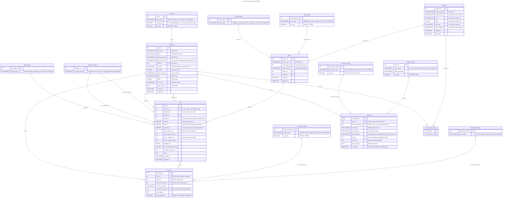

```mermaid

---
title: "City of Orlando Loaners (COOL) "
---

    %% Legend: 
    %% [CORE] = Core entity table (main business objects)
    %% [LOOKUP] = Lookup table (controlled list of allowed values)
    %% [JOIN] = Join/bridge table (many-to-many relationship)

erDiagram
    %% ===[ LOOKUP TABLES ]===
    user_role {
        %% [LOOKUP] Defines Admin, Employee, Citizen and flags like dl_required (citizen ONLY)
        INT role_id PK
        VARCHAR(50) role_name "Admin, Employee, Citizen (NOT NULL UNIQUE)"
        BOOLEAN dl_required "(1 = DL REQUIRED), (0 = NOT required), (NOT NULL)"
        %% useful for debugging user roles
        BOOLEAN is_active "(DEFAULT TRUE)" 
    }

    user_action_type {
        %% [LOOKUP] Defines system-wide actions by any user
        %% MVP 2.0 might want to include: Login, Logout, Export, Update
        %% This is used by action_log to describe *what* the user did
        INT user_action_type_id PK
        VARCHAR(50) user_action_name "Create, Read, Update, Delete (NOT NULL UNIQUE)"
        BOOLEAN is_active "(DEFAULT TRUE NOT NULL)"
    }

    device_type {
        %% [LOOKUP] Allowed types of devices in the system
        INT device_type_id PK
        VARCHAR(50) type_name "Mobile Phone, Laptop, Tablet, etc. (NOT NULL UNIQUE)"
        BOOLEAN is_active "(DEFAULT TRUE)"
    }

    device_status{
        %% [LOOKUP] Allowed device states
        INT device_status_id PK
        VARCHAR(50) status_name "Available, Loaned, Maintenance, Retired, Lost (NOT NULL UNIQUE)"
    }

    device_condition {
        %% [LOOKUP] Allowed physical condition values
        INT condition_id PK
        VARCHAR(50) condition_name "Excellent, Good, Fair, Poor, Damaged, (NOT NULL UNIQUE)"
    }

    loan_status {
        %% [LOOKUP] Allowed loan lifecycle states
        INT loan_status_id PK
        VARCHAR(50) status_name "Open, Returned, Overdue, Lost, (NOT NULL UNIQUE)" 
    }

    loan_action_type {
        %% [LOOKUP] Defines loan-specific actions
        INT loan_action_type_id PK
        VARCHAR(50) action_name "Checkout, Return, Status_Change, (NOT NULL UNIQUE)"
        %% allows you to turn off loans durings maintenance
        BOOLEAN is_active "(DEFAULT TRUE)" 
    }

    database_table {
        INT table_id PK
        VARCHAR(50) table_name "app_user, device, loan, location, loan_log, action_log"
        VARCHAR(100) table_description
        BOOLEAN is_active "(DEFAULT TRUE)"
    }

    transaction_status {
       %% [LOOKUP] Defines the outcome of a logged action
       INT transaction_status_id PK
       VARCHAR(50) status_name "Success, Failed, Pending, (NOT NULL UNIQUE)"
    }

    %% ===[ CORE ENTITY TABLES ]===
    
    app_user {
        %% [CORE] All users (Admins, Employees, Citizens)
        %% NOTE: Initialize with root admin  
        INT user_id PK
        VARCHAR(100) full_name "(NOT NULL)"
        VARCHAR(100) email "(UNIQUE NOT NULL)"
        VARCHAR(255) password_hash "(NOT NULL)"
        VARBINARY(64) password_salt "per-user salt for hashing passwords NOT NULL"
        %% INT role_id (NOT NULL) Ensures that every user has a role, a user cannot exist in the system without one
        INT role_id FK "NOT NULL"  
        VARCHAR(50) dl_num "(nullable unless role.dl_required = 1)"
        CHAR(2) dl_state "Citizen DL state"
        VARCHAR(255) street_address "Citizen address"
        VARCHAR(100) city "Citizen City"
        CHAR(2) state "Citizen State"
        VARCHAR(10) zip_code "Citizen zip code" 
        DATE date_of_birth "Citizen DOB"
        TIMESTAMP created_at
        TIMESTAMP updated_at
    }
    
    location {
        %% [CORE] Community Center Sites
        INT location_id PK
        VARCHAR(100) location_name "NOT NULL"
        VARCHAR(255) street_address "Community Center address"
        VARCHAR(100) city "Community Center city"
        CHAR(2) state "Community Center state"
        VARCHAR(10) zip_code "community center zip"
        VARCHAR(20) contact_phone "Community Center phone"
        TIMESTAMP created_at 
        TIMESTAMP updated_at
    }

    device {
        %% [CORE] Physical devices that can be loaned
        INT device_id PK
        VARCHAR(100) device_name "(NOT NULL)"
        INT device_type_id FK "Points to device_type"
        VARCHAR(100) serial_number "(NOT NULL UNIQUE)"
        
        %% status_id FK - This column links each device to a row in the device_status table. 
        %% For example: A device might have a status of "Available" or "Loaned".
        %% This tracks the device's current state (Avail, Loaned, Maintenance, Retired, Lost)
        %% Allows for easy changes by an admin
        INT status_id FK  
        
        INT location_id FK
        TIMESTAMP created_at
        TIMESTAMP updated_at
    }

    loan {
        %% [CORE] One device loaned to a citizen, process by an employee
        INT loan_id PK 
        INT citizen_id FK "Points to app_user (the borrower)"
        INT employee_id FK "Points to app_user (staff)"
        INT device_id FK
        INT status_id FK "Points to loan_status (Open, Returned,etc.)"
       
        DATETIME start_at "when the loan begins"
        DATETIME due_at "when the device should be returned"
        DATETIME returned_at "when the device was actually returned"
        
        INT loan_condition_id FK "points to device_condition"
        TEXT loan_condition_notes
        INT return_condition_id FK "points to device_condition"
        TEXT return_condition_notes

        DECIMAL damage_fee 
        BOOLEAN all_accessories_returned
        TEXT missing_accessories
        TEXT notes
        TIMESTAMP created_at
        TIMESTAMP updated_at
    }

    loan_log {
        %% [CORE] Audit trail of actions on a loan
        INT loan_log_id PK
        INT loan_id FK "Which loan this action belongs to"
        INT user_id FK "Points to app_user"
        INT loan_action_type_id FK "Points to loan_action_type"
        VARCHAR(255) success_message
        INT transaction_status_id FK "Points to transaction_status table"
        TEXT error_details
        TIMESTAMP loan_timestamp "DEFAULT CURRENT_TIMESTAMP"
    }

    action_log {
        %% [CORE] System-wide audit trail of all user actions
        BIGINT action_log_id PK
        INT user_id FK "Points to app_user (NOT NULL)"
        INT user_action_type_id FK "Points to user_action_type (NOT NULL)"
        VARCHAR(500) current_url "Webpage user was on"
        VARCHAR(500) api_endpoint "API endpoint called" 
        VARCHAR(100) table_affected "Database table involved (device, loan, app_user, etc.)"
        INT table_id FK "Points to database_table (NOT NULL)" 
        INT record_id "Specific record ID affected"
        TEXT action_details "Additional context"
        TIMESTAMP created_at "(DEFAULT CURRENT_TIMESTAMP)"
   } 

    %% ===[ JOIN TABLE ]===
    user_location_access {
        %% [JOIN] Allows one employee to work at many locations, and one location to have many employees
        INT user_id FK
        INT location_id FK
        %% PK (user_id, location_id)
    }

    %% ===[ RELATIONSHIPS ]===

    user_role ||--o{ app_user : "role_id"
    device_status ||--o{ device : "status_id"
    device_type ||--o{ device : "device_type_id"
    loan_status ||--o{ loan : "status_id"
    device_condition ||--o{ loan : "loan_condition_id"
    device_condition ||--o{ loan : "return_condition_id"

    app_user ||--o{ loan : "citizen_id"
    app_user ||--o{ loan : "employee_id"
    app_user ||--o{ user_location_access : "user_id"
    app_user ||--o{ loan_log : "user_id"
    app_user ||--o{ action_log : "user_id"

    
    location ||--o{ device : "location_id"
    location ||--o{ user_location_access : "location_id"

    device ||--o{ loan : "device_id"
    loan ||--o{ loan_log : "loan_id"

    loan_action_type ||--o{ loan_log : "loan_action_type_id"
    user_action_type ||--o{ action_log : "user_action_type_id"
    transaction_status ||--o{ loan_log : "transaction_status_id"
    database_table ||--o{ action_log : "table_id"

```

