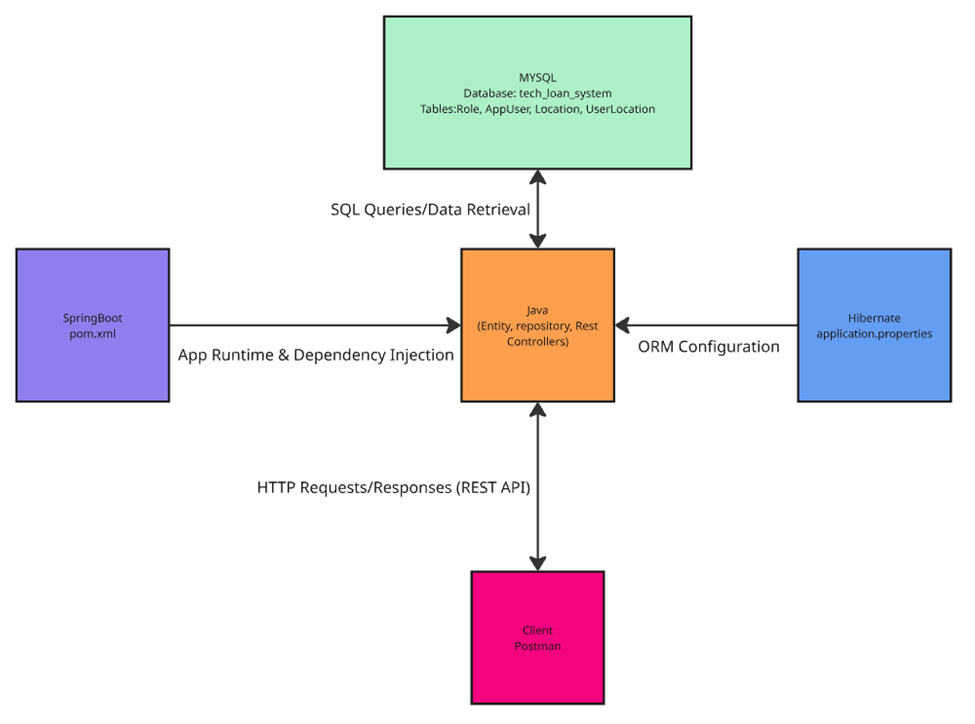
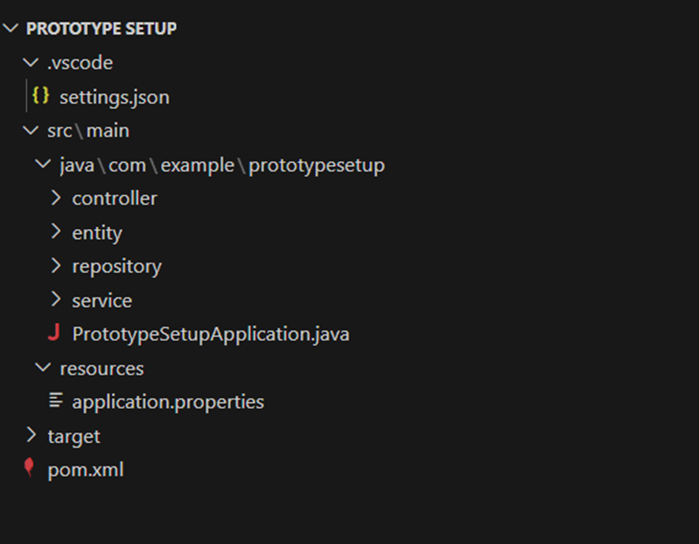
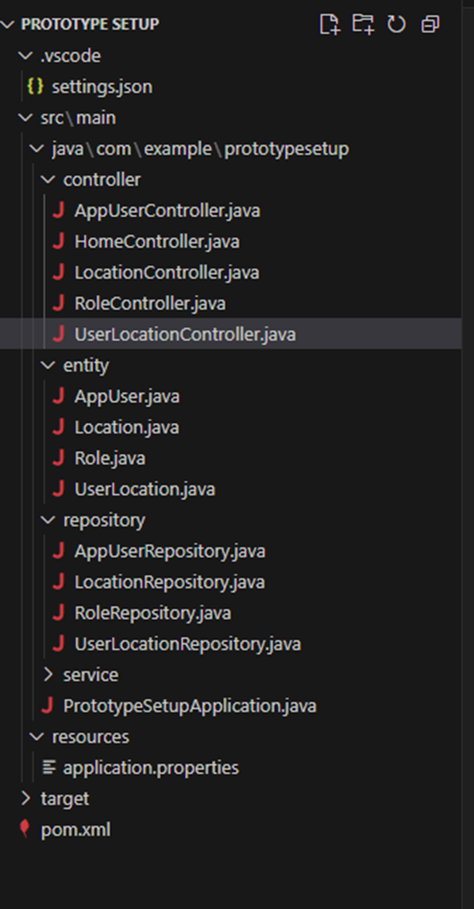

# API Development Roadmap for Location CRUD + Management (Admin)

**Author:** Jose Cartagena  
**Course:** COP-3330C-14319  
**Project:** Location CRUD + Management (Admin)

In the database step, I created a new MySQL database called tech_loan_system to serve as the backend data store for the API. Within this database, I designed tables that represent the core entities of the system, such as Location, AppUser, and Role. Relationships were set up to reflect how the entities interact, for example, users can be linked to multiple locations and roles. This database structure provides the foundation for the API, ensuring that the data can be stored, retrieved, and managed effectively through the application.


## 1. Database Setup
This structure normalizes the database, avoids redundant data, and enforces relationships through foreign keys. It ensures scalability (e.g., adding new roles or locations without breaking existing data).
- Created the database `tech_loan_system` in MySQL.
```sql
CREATE DATABASE tech_loan_system;
USE tech_loan_system;
```
- Defined tables: 

`Location: Represents a physical location (community centers).` 
```sql
CREATE TABLE location (
    location_id INT AUTO_INCREMENT PRIMARY KEY,
    location_name VARCHAR(100) NOT NULL UNIQUE,
    address VARCHAR(255),
    created_at TIMESTAMP DEFAULT CURRENT_TIMESTAMP
);

```
------
`AppUser: Stores user accounts (username, password, email) and links to a role.`
```sql
CREATE TABLE app_user (
    user_id INT AUTO_INCREMENT PRIMARY KEY,
    username VARCHAR(50) NOT NULL UNIQUE,
    password VARCHAR(255) NOT NULL,
    email VARCHAR(100) NOT NULL UNIQUE,
    role_id INT NOT NULL,
    created_at TIMESTAMP DEFAULT CURRENT_TIMESTAMP,
    FOREIGN KEY (role_id) REFERENCES role(role_id)
);
```
------
`Role: Defines what type of user (Admin, Employee, Citizen). The flags (dl_flag, other_perm_flag) are used to enforce special requirements (e.g., does the role require a driver’s license?).`
```sql
CREATE TABLE role (
    role_id INT AUTO_INCREMENT PRIMARY KEY,
    role_name VARCHAR(50) NOT NULL UNIQUE,
    dl_flag BOOLEAN DEFAULT 0,         -- whether DL required
    other_perm_flag BOOLEAN DEFAULT 0  -- extra permissions
);
```
------
`UserLocation: A many-to-many mapping table that connects users with locations. A single user may be assigned to multiple locations, and a location may have multiple users.`
```sql
CREATE TABLE user_location (
    user_location_id INT AUTO_INCREMENT PRIMARY KEY,
    user_id INT NOT NULL,
    location_id INT NOT NULL,
    assigned_at TIMESTAMP DEFAULT CURRENT_TIMESTAMP,
    FOREIGN KEY (user_id) REFERENCES app_user(user_id) ON DELETE CASCADE,
    FOREIGN KEY (location_id) REFERENCES location(location_id) ON DELETE CASCADE,
    UNIQUE(user_id, location_id) -- prevent duplicate assignments
);
```
------
`Insert Sample Data (for testing API later in Postman)(Optional)`
```sql
-- Roles
INSERT INTO role (role_name, dl_flag, other_perm_flag) VALUES
('Admin', 0, 1),
('Employee', 0, 0),
('Citizen', 1, 0);

-- Users
INSERT INTO app_user (username, password, email, role_id) VALUES
('admin1', 'adminPass123', 'admin1@orlando.gov', 1),
('employee1', 'empPass123', 'employee1@orlando.gov', 2),
('citizen1', 'citizenPass123', 'citizen1@email.com', 3);

-- Locations
INSERT INTO location (location_name, address) VALUES
('Downtown Community Center', '123 Main St, Orlando, FL'),
('East Side Center', '456 Oak Ave, Orlando, FL');

-- Assign employee to a location
INSERT INTO user_location (user_id, location_id) VALUES
(2, 1); -- employee1 → Downtown Community Center

```

## 2. Entities with Hibernate
Now we are moving to the Visual Code Studio and preparing to set up the folders.

First we must fill the entity folder with java class where we will Ensure proper JPA annotations (@Entity, @Table, @Id, @ManyToOne, @ManyToMany, etc.).

Each database table is mirrored as a Java entity class.

Annotations like @Entity, @Table, @Id, and relationships (@ManyToOne, @ManyToMany) map Java objects to SQL tables.

Hibernate allows working with Java objects instead of raw SQL. This makes the code cleaner and less error-prone while still enforcing database constraints.

- Implemented JPA entities (`Location`, `AppUser`, `Role`, `UserLocation`).

`Create the Role.java class`
```java
package com.example.prototypesetup.entity;

import jakarta.persistence.*;

@Entity
@Table(name = "role")
public class Role {
    @Id
    @GeneratedValue(strategy = GenerationType.IDENTITY)
    private Long roleId;

    @Column(nullable = false, unique = true, length = 50)
    private String roleName;

    private boolean dlFlag;          // requires Driver’s License?
    private boolean otherPermFlag;   // extra permissions

    // Getters and setters
    public Long getRoleId() { return roleId; }
    public void setRoleId(Long roleId) { this.roleId = roleId; }

    public String getRoleName() { return roleName; }
    public void setRoleName(String roleName) { this.roleName = roleName; }

    public boolean isDlFlag() { return dlFlag; }
    public void setDlFlag(boolean dlFlag) { this.dlFlag = dlFlag; }

    public boolean isOtherPermFlag() { return otherPermFlag; }
    public void setOtherPermFlag(boolean otherPermFlag) { this.otherPermFlag = otherPermFlag; }
}

```
------
`Create the AppUser.java class`
```java
package com.example.prototypesetup.entity;

import jakarta.persistence.*;
import java.util.HashSet;
import java.util.Set;

@Entity
@Table(name = "app_user")
public class AppUser {
    @Id
    @GeneratedValue(strategy = GenerationType.IDENTITY)
    private Long userId;

    @Column(nullable = false, unique = true, length = 50)
    private String username;

    @Column(nullable = false)
    private String password;

    @Column(nullable = false, unique = true, length = 100)
    private String email;

    @ManyToOne
    @JoinColumn(name = "role_id", nullable = false)
    private Role role;

    @ManyToMany
    @JoinTable(
        name = "user_location",
        joinColumns = @JoinColumn(name = "user_id"),
        inverseJoinColumns = @JoinColumn(name = "location_id")
    )
    private Set<Location> locations = new HashSet<>();

    // Getters and setters
    public Long getUserId() { return userId; }
    public void setUserId(Long userId) { this.userId = userId; }

    public String getUsername() { return username; }
    public void setUsername(String username) { this.username = username; }

    public String getPassword() { return password; }
    public void setPassword(String password) { this.password = password; }

    public String getEmail() { return email; }
    public void setEmail(String email) { this.email = email; }

    public Role getRole() { return role; }
    public void setRole(Role role) { this.role = role; }

    public Set<Location> getLocations() { return locations; }
    public void setLocations(Set<Location> locations) { this.locations = locations; }
}
```
------
`Create the Location.java class`
```java
package com.example.prototypesetup.entity;

import jakarta.persistence.*;
import java.util.HashSet;
import java.util.Set;

@Entity
@Table(name = "location")
public class Location {
    @Id
    @GeneratedValue(strategy = GenerationType.IDENTITY)
    private Long locationId;

    @Column(nullable = false, unique = true, length = 100)
    private String locationName;

    private String address;

    @ManyToMany(mappedBy = "locations")
    private Set<AppUser> users = new HashSet<>();

    // Getters and setters
    public Long getLocationId() { return locationId; }
    public void setLocationId(Long locationId) { this.locationId = locationId; }

    public String getLocationName() { return locationName; }
    public void setLocationName(String locationName) { this.locationName = locationName; }

    public String getAddress() { return address; }
    public void setAddress(String address) { this.address = address; }

    public Set<AppUser> getUsers() { return users; }
    public void setUsers(Set<AppUser> users) { this.users = users; }
}
```
------
`Create UserLocation.java class`
```java
package com.example.prototypesetup.entity;

import jakarta.persistence.*;
import java.time.LocalDateTime;

@Entity
@Table(name = "user_location")
public class UserLocation {
    @Id
    @GeneratedValue(strategy = GenerationType.IDENTITY)
    private Long userLocationId;

    @ManyToOne
    @JoinColumn(name = "user_id", nullable = false)
    private AppUser user;

    @ManyToOne
    @JoinColumn(name = "location_id", nullable = false)
    private Location location;

    private LocalDateTime assignedAt = LocalDateTime.now();

    // Getters and setters
    public Long getUserLocationId() { return userLocationId; }
    public void setUserLocationId(Long userLocationId) { this.userLocationId = userLocationId; }

    public AppUser getUser() { return user; }
    public void setUser(AppUser user) { this.user = user; }

    public Location getLocation() { return location; }
    public void setLocation(Location location) { this.location = location; }

    public LocalDateTime getAssignedAt() { return assignedAt; }
    public void setAssignedAt(LocalDateTime assignedAt) { this.assignedAt = assignedAt; }
}
```


## 3. Create pom file
 Create the pom.xml file in the root directory and include the following dependencies
- spring-boot-starter-web
- spring-boot-starter-data-jpa
- mysql-connector-java
- lombok (optional)
- spring-boot-starter-test

Centralizes all project dependencies. Without this, you’d need to manually manage libraries, which is error-prone. 

```
<?xml version="1.0" encoding="UTF-8"?>
<project xmlns="http://maven.apache.org/POM/4.0.0"
         xmlns:xsi="http://www.w3.org/2001/XMLSchema-instance"
         xsi:schemaLocation="http://maven.apache.org/POM/4.0.0 
                             https://maven.apache.org/xsd/maven-4.0.0.xsd">

    <modelVersion>4.0.0</modelVersion>

    <groupId>com.example</groupId>
    <artifactId>prototypesetup</artifactId>
    <version>0.0.1-SNAPSHOT</version>
    <name>Prototype Setup</name>
    <description>Prototype Setup for Tech Loan System</description>

    <properties>
        <java.version>17</java.version>
        <spring-boot.version>3.2.4</spring-boot.version>
    </properties>

    <dependencyManagement>
        <dependencies>
            <dependency>
                <groupId>org.springframework.boot</groupId>
                <artifactId>spring-boot-dependencies</artifactId>
                <version>${spring-boot.version}</version>
                <type>pom</type>
                <scope>import</scope>
            </dependency>
        </dependencies>
    </dependencyManagement>

    <dependencies>
        <!-- Spring Boot Starter for REST APIs -->
        <dependency>
            <groupId>org.springframework.boot</groupId>
            <artifactId>spring-boot-starter-web</artifactId>
        </dependency>

        <!-- Spring Boot Starter Data JPA (Hibernate + Jakarta Persistence) -->
        <dependency>
            <groupId>org.springframework.boot</groupId>
            <artifactId>spring-boot-starter-data-jpa</artifactId>
        </dependency>

        <!-- MySQL Connector (version controlled by Spring Boot) -->
        <dependency>
    <groupId>mysql</groupId>
    <artifactId>mysql-connector-java</artifactId>
    <version>8.0.33</version>
    <scope>runtime</scope>
</dependency>


        <!-- Lombok (optional, reduces boilerplate getters/setters) -->
        <dependency>
            <groupId>org.projectlombok</groupId>
            <artifactId>lombok</artifactId>
            <optional>true</optional>
        </dependency>

        <!-- Testing -->
        <dependency>
            <groupId>org.springframework.boot</groupId>
            <artifactId>spring-boot-starter-test</artifactId>
            <scope>test</scope>
        </dependency>
    </dependencies>

    <build>
        <plugins>
            <!-- Spring Boot Maven Plugin -->
            <plugin>
                <groupId>org.springframework.boot</groupId>
                <artifactId>spring-boot-maven-plugin</artifactId>
                <version>${spring-boot.version}</version>
            </plugin>
        </plugins>
    </build>

</project>
```
## 4. Repository Layer (Spring Data JPA)
for the repository folder we must create 4 interfaces for one of each entity. Each of these interfaces gives you. Each entity has a corresponding Repository interface extending JpaRepository.
These repositories provide CRUD operations automatically (find, save, delete, etc.), so developers don’t need to write boilerplate SQL. Promotes separation of concerns. Business logic stays in services/controllers, while repositories handle persistence.

- Created Spring Data JPA repositories for each entity.
- Extended `JpaRepository` for CRUD support.

`Create RoleRepository.java class`
```java
package com.example.prototypesetup.repository;

import com.example.prototypesetup.entity.Role;
import org.springframework.data.jpa.repository.JpaRepository;
import org.springframework.stereotype.Repository;

@Repository
public interface RoleRepository extends JpaRepository<Role, Long> {
    Role findByRoleName(String roleName);
}
```
------
`Create AppUserRepository.java`
```java
package com.example.prototypesetup.repository;

import com.example.prototypesetup.entity.AppUser;
import org.springframework.data.jpa.repository.JpaRepository;
import org.springframework.stereotype.Repository;

@Repository
public interface AppUserRepository extends JpaRepository<AppUser, Long> {
    AppUser findByUsername(String username);
}
```
------
`Create LocationRepository.java`
```java
package com.example.prototypesetup.repository;

import com.example.prototypesetup.entity.Location;
import org.springframework.data.jpa.repository.JpaRepository;
import org.springframework.stereotype.Repository;

@Repository
public interface LocationRepository extends JpaRepository<Location, Long> {
    Location findByLocationName(String locationName);
}
```
------
`Create UserLocationRepository.java (only if you kept UserLocation.java) `
```java
package com.example.prototypesetup.repository;

import com.example.prototypesetup.entity.UserLocation;
import org.springframework.data.jpa.repository.JpaRepository;
import org.springframework.stereotype.Repository;

@Repository
public interface UserLocationRepository extends JpaRepository<UserLocation, Long> {
}
```

## 5. Creating the Hibernate File
next the hibernate file will be made in this folder src/main/resources/application.properties
Configures the database connection (url, username, password).
Central config ensures flexibility. For example, switching from MySQL to PostgreSQL would only require a config change, not rewriting code.

`application.properties`
```
# Database connection
spring.datasource.url=jdbc:mysql://localhost:3306/tech_loan_system
spring.datasource.username=root
spring.datasource.password=F@110utD05
spring.datasource.driver-class-name=com.mysql.cj.jdbc.Driver

# Hibernate (JPA) settings
spring.jpa.hibernate.ddl-auto=update
spring.jpa.show-sql=true
spring.jpa.database-platform=org.hibernate.dialect.MySQL8Dialect

# Optional: log SQL queries to console
logging.level.org.hibernate.SQL=DEBUG
logging.level.org.hibernate.type.descriptor.sql.BasicBinder=TRACE
```

## 6. Main Application to run hibernate 
Simplifies application startup. Instead of setting up a server manually, Spring Boot does it for you.
`PrototypeSetupApplication`
```java
package com.example.prototypesetup;

import org.springframework.boot.SpringApplication;
import org.springframework.boot.autoconfigure.SpringBootApplication;

@SpringBootApplication
public class PrototypeSetupApplication {
    public static void main(String[] args) {
        SpringApplication.run(PrototypeSetupApplication.class, args);
    }
}
```
After of which we will test and run to test spring boot running with hibernate, be sure to run these commands in terminal on root directory.
- mvn clean install
- mvn spring-boot:run


# <span style="color:red">⚠️ 7. Controllers (Still under development: Error 500)</span>

- Implemented REST controllers for each entity within the controller folder:
  - `LocationController`
  - `AppUserController`
  - `RoleController`
  - `UserLocationController`
- Added CRUD endpoints: **GET**, **POST**, **PUT**, **DELETE**.

First lets run a test class to see if your code is able to connect through springboot
`Create HomeController.java class`
```java
package com.example.prototypesetup.controller;

import org.springframework.web.bind.annotation.GetMapping;
import org.springframework.web.bind.annotation.RestController;

@RestController
public class HomeController {

    @GetMapping("/")
    public String home() {
        return "Welcome to Prototype Setup!";
    }
}
```
-----
`Create LocationController.java class`
```java
package com.example.prototypesetup.controller;

import com.example.prototypesetup.entity.Location;
import com.example.prototypesetup.repository.LocationRepository;
import org.springframework.beans.factory.annotation.Autowired;
import org.springframework.http.HttpStatus;
import org.springframework.http.ResponseEntity;
import org.springframework.web.bind.annotation.*;
import org.springframework.web.server.ResponseStatusException;

import java.util.List;

@RestController
@RequestMapping("/api/locations")
public class LocationController {

    @Autowired
    private LocationRepository locationRepository;

    // GET all locations
    @GetMapping
    public List<Location> getAllLocations() {
        return locationRepository.findAll();
    }

   // GET location by ID safely
@GetMapping("/{id}")
public ResponseEntity<LocationDTO> getLocationById(@PathVariable Long id) {
    return locationRepository.findById(id)
            .map(location -> ResponseEntity.ok(new LocationDTO(
                    location.getLocationId(),
                    location.getLocationName(),
                    location.getAddress()
            )))
            .orElseThrow(() -> new ResponseStatusException(HttpStatus.NOT_FOUND, "Location not found with id " + id));
}

// DTO class inside the controller (or a separate file)
public static class LocationDTO {
    private Long locationId;
    private String locationName;
    private String address;

    public LocationDTO(Long locationId, String locationName, String address) {
        this.locationId = locationId;
        this.locationName = locationName;
        this.address = address;
    }

    // Getters
    public Long getLocationId() { return locationId; }
    public String getLocationName() { return locationName; }
    public String getAddress() { return address; }
}

    // CREATE location
    @PostMapping
    public Location createLocation(@RequestBody Location location) {
        return locationRepository.save(location);
    }

    // UPDATE location
    @PutMapping("/{id}")
    public Location updateLocation(@PathVariable Long id, @RequestBody Location updatedLocation) {
        return locationRepository.findById(id).map(location -> {
            location.setLocationName(updatedLocation.getLocationName());
            location.setAddress(updatedLocation.getAddress());
            return locationRepository.save(location);
        }).orElseThrow(() -> new ResponseStatusException(HttpStatus.NOT_FOUND, "Location not found with id " + id));
    }

    // DELETE location safely
    @DeleteMapping("/{id}")
    public ResponseEntity<Void> deleteLocation(@PathVariable Long id) {
        Location location = locationRepository.findById(id)
                .orElseThrow(() -> new ResponseStatusException(HttpStatus.NOT_FOUND, "Location not found with id " + id));

        // Remove associations with users to avoid foreign key constraint issues
        location.getUsers().forEach(user -> user.getLocations().remove(location));

        locationRepository.delete(location);
        return ResponseEntity.noContent().build(); // HTTP 204 No Content
    }
}
```
-----
`Create AppUserController.java class`
```java
package com.example.prototypesetup.controller;

import com.example.prototypesetup.entity.AppUser;
import com.example.prototypesetup.repository.AppUserRepository;
import org.springframework.beans.factory.annotation.Autowired;
import org.springframework.http.ResponseEntity;
import org.springframework.web.bind.annotation.*;

import java.util.List;

@RestController
@RequestMapping("/api/users")
public class AppUserController {

    @Autowired
    private AppUserRepository appUserRepository;

    // GET all users
    @GetMapping
    public List<AppUser> getAllUsers() {
        return appUserRepository.findAll();
    }

    // GET user by ID
    @GetMapping("/{id}")
    public ResponseEntity<AppUser> getUserById(@PathVariable Long id) {
        return appUserRepository.findById(id)
                .map(ResponseEntity::ok)
                .orElse(ResponseEntity.notFound().build());
    }

    // CREATE user
    @PostMapping
    public AppUser createUser(@RequestBody AppUser user) {
        return appUserRepository.save(user);
    }

    // DELETE user
    @DeleteMapping("/{id}")
    public ResponseEntity<Void> deleteUser(@PathVariable Long id) {
        return appUserRepository.findById(id)
                .map(user -> {
                    appUserRepository.delete(user);
                    return ResponseEntity.noContent().build();
                })
                .orElse(ResponseEntity.notFound().build());
    }
}
```
-----
`Create RoleController.java class`
```java
package com.example.prototypesetup.controller;

import com.example.prototypesetup.entity.Role;
import com.example.prototypesetup.repository.RoleRepository;
import org.springframework.beans.factory.annotation.Autowired;
import org.springframework.http.ResponseEntity;
import org.springframework.web.bind.annotation.*;

import java.util.List;

@RestController
@RequestMapping("/api/roles")
public class RoleController {

    @Autowired
    private RoleRepository roleRepository;

    // GET all roles
    @GetMapping
    public List<Role> getAllRoles() {
        return roleRepository.findAll();
    }

    // GET role by ID
    @GetMapping("/{id}")
    public ResponseEntity<Role> getRoleById(@PathVariable Long id) {
        return roleRepository.findById(id)
                .map(ResponseEntity::ok)
                .orElse(ResponseEntity.notFound().build());
    }

    // CREATE role
    @PostMapping
    public Role createRole(@RequestBody Role role) {
        return roleRepository.save(role);
    }

    // DELETE role
    @DeleteMapping("/{id}")
    public ResponseEntity<Void> deleteRole(@PathVariable Long id) {
        return roleRepository.findById(id)
                .map(role -> {
                    roleRepository.delete(role);
                    return ResponseEntity.noContent().build();
                })
                .orElse(ResponseEntity.notFound().build());
    }
}
```
----
`Create UserLocationController.java class (Optional)`
```java 
package com.example.prototypesetup.controller;

import com.example.prototypesetup.entity.UserLocation;
import com.example.prototypesetup.repository.UserLocationRepository;
import org.springframework.beans.factory.annotation.Autowired;
import org.springframework.http.ResponseEntity;
import org.springframework.web.bind.annotation.*;

import java.util.List;

@RestController
@RequestMapping("/api/user-locations")
public class UserLocationController {

    @Autowired
    private UserLocationRepository userLocationRepository;

    // GET all user-location links
    @GetMapping
    public List<UserLocation> getAll() {
        return userLocationRepository.findAll();
    }

    // CREATE link
    @PostMapping
    public UserLocation create(@RequestBody UserLocation ul) {
        return userLocationRepository.save(ul);
    }

    // DELETE link
    @DeleteMapping("/{id}")
    public ResponseEntity<Void> delete(@PathVariable Long id) {
        return userLocationRepository.findById(id)
                .map(ul -> {
                    userLocationRepository.delete(ul);
                    return ResponseEntity.noContent().build();
                })
                .orElse(ResponseEntity.notFound().build());
    }
}
```

## 8 Complete Folder with all classesd and files


## 9. Postman Testing
- Verified endpoints:
  - `GET /api/locations` → Fetch all locations
  - `GET /api/locations/{id}` → Fetch location by ID
  - `POST /api/locations` → Add a new location
  - `DELETE /api/locations/{id}` → Delete location
- Noted issue: **500 error** on GET/DELETE by ID (to be debugged).

## 10. Next Steps
- Debug GET/DELETE issue for `Location`.
- Implement and test controllers for `AppUser`, `Role`, and `UserLocation`.
- Add role-based management for admin features.
- Document test cases for each endpoint.

---

